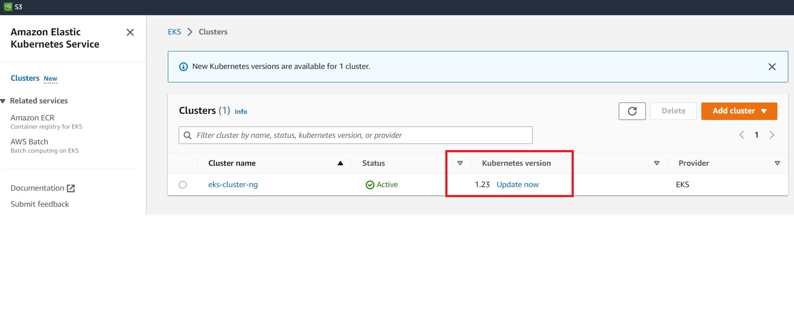

# Create cluster with autoscaler

In this section, we will create a autoscaler that allows us to dynamically scale the nodes within a nodegroup - in and out.  We will start by adding 3 new nodegroups to our existing cluster `eks-cluster-ng`: 

* ***scale-east1b*** : Represents on-demand instances of one instance type running on a single AZ for stateful workloads
* ***scale-east1c*** : Represents on-demand instances of multiple instance types running on a single AZ for stateful workloads
* ***scale-spot*** : represents spot instances running on multi AZ for stateless workloads

The cluster auto-scaler automatically launches additional worker nodes if more resources are needed, and shutdowns worker nodes if they are under-utilized. The autoscaling works within a nodegroup, hence we will create a nodegroup first which has this feature enabled.

Create folder `cluster-autoscaler`. Copy the following contents into file  `eks-cluster.yaml`:

```
piVersion: eksctl.io/v1alpha5
kind: ClusterConfig

metadata:
  name: eks-cluster-ng
  region: us-east-1

nodeGroups:
  - name: scale-east1b
    instanceType: t2.nano
    desiredCapacity: 1
    maxSize: 2
    availabilityZones: ["us-east-1b"]
    iam:
      withAddonPolicies:
        autoScaler: true
    labels:
      nodegroup-type: stateful-east1b
      instance-type: onDemand
  - name: scale-east1c
    instanceType: t2.micro
    desiredCapacity: 1
    maxSize: 3
    availabilityZones: ["us-east-1c"]
    iam:
      withAddonPolicies:
        autoScaler: true
    labels:
      nodegroup-type: stateful-east1c
      instance-type: onDemand
    ssh: # use existing EC2 key
      publicKeyName: eks-course
  - name: scale-spot
    desiredCapacity: 1
    maxSize: 4
    instancesDistribution:
      instanceTypes: ["t2.micro", "t2.small"]
      onDemandBaseCapacity: 0
      onDemandPercentageAboveBaseCapacity: 0
    availabilityZones: ["us-east-1b","us-east-1c"]
    iam:
      withAddonPolicies:
        autoScaler: true
    labels:
      nodegroup-type: stateless-workload
      instance-type: spot
    ssh: 
      publicKeyName: eks-course

availabilityZones: ["us-east-1b","us-east-1c"]
```

This will tell EKS to :

* Apply additional cluster configurations to cluster `eks-cluster-ng`
* Apply defintions for 3 nodegroups :
    * scale-east1b : On-demand instances in us-east-1b
    * scale-east1c : On-demand instances in us-east-1c
    * scale-spot : Spot instances in us-east-1b, us-east-1c
* Note the autoScaler property is set to `true`

## Create cluster nodegroups
We will now create the new nodegroups in our existing cluster
```
eksctl create nodegroup --config-file=eks-cluster.yaml
```

```
kubectl get nodes
```
```
PS C:\Users\aniru\workspace\github\aws-eks\cluster-autoscaler> kubectl get nodes
NAME                             STATUS   ROLES    AGE     VERSION
ip-192-168-14-220.ec2.internal   Ready    <none>   2m7s    v1.23.15-eks-49d8fe8
ip-192-168-20-253.ec2.internal   Ready    <none>   4h51m   v1.23.15-eks-49d8fe8
ip-192-168-33-152.ec2.internal   Ready    <none>   4h51m   v1.23.15-eks-49d8fe8
ip-192-168-53-222.ec2.internal   Ready    <none>   78s     v1.23.15-eks-49d8fe8
ip-192-168-61-217.ec2.internal   Ready    <none>   2m56s   v1.23.15-eks-49d8fe8
```
Check the AGE column to see which of the instances were started. Now let's check the nodegroups using :
```
eksctl get nodegroup --cluster=eks-cluster-ng
```
```
PS C:\Users\aniru\workspace\github\aws-eks\cluster-autoscaler> eksctl get nodegroup --cluster=eks-cluster-ng
CLUSTER         NODEGROUP       STATUS          CREATED                 MIN SIZE        MAX SIZE        DESIRED CAPACITY        INSTANCE TYPE   IMAGE ID           ASG NAME                                                                TYPE
eks-cluster-ng  ng-1            CREATE_COMPLETE 2023-02-14T07:23:00Z    2               2               2                       t2.nano         ami-0d4bdb1cf2f07d811      eksctl-eks-cluster-ng-nodegroup-ng-1-NodeGroup-1LRT8H4ZKAVO9            unmanaged
eks-cluster-ng  scale-east1b    CREATE_COMPLETE 2023-02-14T12:10:31Z    1               2               1                       t2.nano         ami-0d4bdb1cf2f07d811      eksctl-eks-cluster-ng-nodegroup-scale-east1b-NodeGroup-PVRF5CRPR3DU     unmanaged
eks-cluster-ng  scale-east1c    CREATE_COMPLETE 2023-02-14T12:10:31Z    1               3               1                       t2.nano         ami-0d4bdb1cf2f07d811      eksctl-eks-cluster-ng-nodegroup-scale-east1c-NodeGroup-15I9RHLLNMPQR    unmanaged
eks-cluster-ng  scale-spot      CREATE_COMPLETE 2023-02-14T12:10:32Z    1               4               1                       t2.micro        ami-0d4bdb1cf2f07d811      eksctl-eks-cluster-ng-nodegroup-scale-spot-NodeGroup-1SZS5D6OYGK21      unmanaged
```
Let's delete the starter nodegroup `ng-1`
```
eksctl delete nodegroup --cluster=eks-cluster-ng  --name='ng-1'          
```
```
PS C:\Users\aniru\workspace\github\aws-eks\cluster-autoscaler> eksctl delete nodegroup --cluster=eks-cluster-ng  --name='ng-1'
2023-02-14 07:31:27 [ℹ]  1 nodegroup (ng-1) was included (based on the include/exclude rules)
2023-02-14 07:31:28 [ℹ]  will drain 1 nodegroup(s) in cluster "eks-cluster-ng"
2023-02-14 07:31:28 [ℹ]  starting parallel draining, max in-flight of 1
2023-02-14 07:31:31 [ℹ]  cordon node "ip-192-168-20-253.ec2.internal"
2023-02-14 07:31:31 [ℹ]  cordon node "ip-192-168-33-152.ec2.internal"
```

## Create deployment for auto-scaler
Deploy the auto-scaler itself:

```
kubectl apply -f https://raw.githubusercontent.com/kubernetes/autoscaler/master/cluster-autoscaler/cloudprovider/aws/examples/cluster-autoscaler-autodiscover.yaml
```

```
PS C:\Users\aniru\workspace\github\aws-eks\cluster-autoscaler> kubectl apply -f https://raw.githubusercontent.com/kubernetes/autoscaler/master/cluster-autoscaler/cloudprovider/aws/examples/cluster-autoscaler-autodiscover.yaml
serviceaccount/cluster-autoscaler created
clusterrole.rbac.authorization.k8s.io/cluster-autoscaler created
role.rbac.authorization.k8s.io/cluster-autoscaler created
clusterrolebinding.rbac.authorization.k8s.io/cluster-autoscaler created
rolebinding.rbac.authorization.k8s.io/cluster-autoscaler created
deployment.apps/cluster-autoscaler created
```
## Add annotation to the deployment 
This prevents from being evicted
```
kubectl -n kube-system annotate deployment.apps/cluster-autoscaler cluster-autoscaler.kubernetes.io/safe-to-evict="false"
```
```
PS C:\Users\aniru\workspace\github\aws-eks\cluster-autoscaler> kubectl -n kube-system annotate deployment.apps/cluster-autoscaler cluster-autoscaler.kubernetes.io/safe-to-evict="false"
deployment.apps/cluster-autoscaler annotated
```
## Set image version and cluster name 
We will now set matching image version and cluster name `eks-cluster-ng` in the deployment. Get the autoscaler image version:  

Open [Kubernetes/Autoscalar Releases](https://github.com/kubernetes/autoscaler/releases) and get the latest release version matching your Kubernetes version, e.g. Kubernetes 1.14 => check for 1.14.n where "n" is the latest release version



Edit deployment and set your EKS cluster name:

```
kubectl -n kube-system edit deployment.apps/cluster-autoscaler
```

* set the image version at property `image=k8s.gcr.io/cluster-autoscaler:vx.yy.z`  
```
image: registry.k8s.io/autoscaling/cluster-autoscaler:v1.23.0
```
* set your EKS cluster name at the end of property `- --node-group-auto-discovery=asg:tag=k8s.io/cluster-autoscaler/enabled,k8s.io/cluster-autoscaler/<<EKS cluster name>>`
```
- --node-group-auto-discovery=asg:tag=k8s.io/cluster-autoscaler/enabled,k8s.io/cluster-autoscaler/eks-cluster-ng
```

```
kubectl -n kube-system describe deployment cluster-autoscaler
```