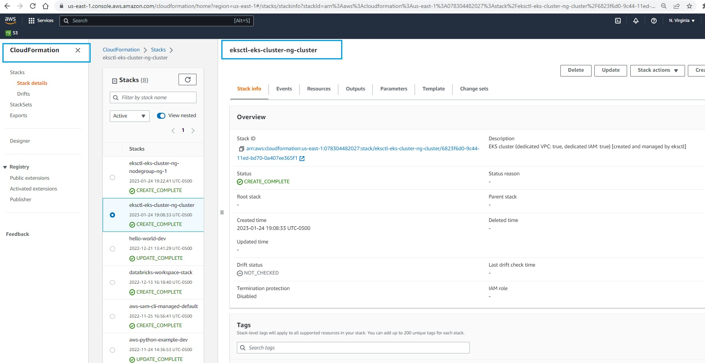
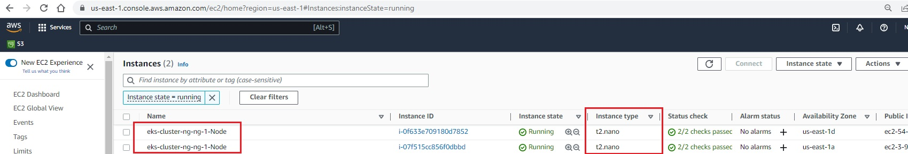

# Create simple Cluster 
In this section, we will create a simple cluster using `eksctl`

## Create Yaml file 
The first step is to create a .yaml file. Let's call it `eks-cluster-ng.yaml`. Copy the following contents :  

```
apiVersion: eksctl.io/v1alpha5
kind: ClusterConfig

metadata:
  name: eks-cluster-ng
  region: us-east-1

nodeGroups:
  - name: ng-1
    instanceType: t2.nano
    desiredCapacity: 2
    ssh: # use existing EC2 key
      publicKeyName: eks-course
```

This will tell EKS cluster to:

* Create a cluster `eks-cluster-ng` in region us-east-1
* Call the name of the nodegroup : ng-1
* Set the instance type as :t2.micro
* Set the desired capcity of instances as 2
* Set ssh key : eks-course 


## Create cluster 
Now we will create the cluster by specfying the file to use with flag `f` with command : `eksctl create cluster`

```
eksctl create cluster -f eks-cluster.yaml
```

This will take 10-15 minutes. Now log into AWS console and navigate to the Cloud Formation service. You will see that `eksctl` creates a cloud formation stack. Check the resources tab to glace through various resources being created. 



## Check cluster 

Now let's check the EC2 console. You will see 2 instances :



Let's use the `eksctl get nodegroup` command to get the details of the nodegroup we just created  : 

```
S C:\Users\aniru\workspace\github\aws-eks> eksctl get nodegroup --cluster eks-cluster-ng
CLUSTER         NODEGROUP       STATUS          CREATED                 MIN SIZE        MAX SIZE        DESIRED CAPACITY        INSTANCE TYPE   IMAGE ID                ASG NAME                                       TYPE
eks-cluster-ng  ng-1            CREATE_COMPLETE 2023-01-25T00:22:41Z    2               2               2                       t2.nano         ami-03a30cc1dda93f173   eksctl-eks-cluster-ng-nodegroup-ng-1-NodeGroup-6387ICJKD3BS     unmanaged
```

Let's use the `kubectl` command to get the nodes : 
```
PS C:\Users\aniru\workspace\github\aws-eks> kubectl get nodes
Kubeconfig user entry is using deprecated API version client.authentication.k8s.io/v1alpha1. Run 'aws eks update-kubeconfig' to update.
NAME                             STATUS   ROLES    AGE   VERSION
ip-192-168-21-105.ec2.internal   Ready    <none>   71m   v1.22.15-eks-fb459a0
ip-192-168-54-187.ec2.internal   Ready    <none>   71m   v1.22.15-eks-fb459a0
```

