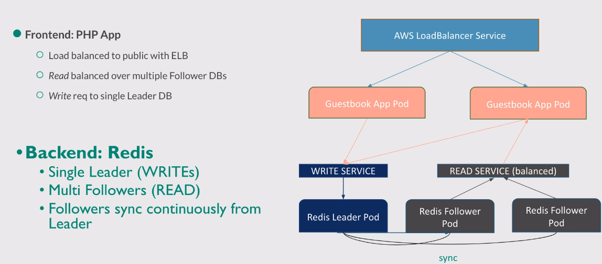

# Create Stateless App
# Setup sample guestbook app
* based on [Kubernetes Guestbook](https://github.com/kubernetes/examples/tree/master/guestbook)



## Create new cluster

Please note that for the following steps we are assuming that the cluster is already running with nodegroup `ng-1` from initial steps
```
eksctl create nodegroup --config-file=eks-cluster-autoscalar.yaml
```

Let's delete the 

```
eksctl delete nodegroup -f eks-course.yaml --include='ng-1' --approve
```


## Redis master
deploy the master Redis pod and a _service_ on top of it:
```
kubectl apply -f redis-master.yaml
kubectl get pods
kubectl get services
```

## Redis slaves
deploy the Redis slave pods and a _service_ on top of it:
```
kubectl apply -f redis-slaves.yaml
kubectl get pods
kubectl get services
```

## Frontend app
deploy the PHP Frontend pods and a _service_ of type **LoadBalancer** on top of it, to expose the loadbalanced service to the public via ELB:
```
kubectl apply -f frontend.yaml
```
some checks:
```
kubectl get pods
kubectl get pods -l app=guestbook
kubectl get pods -l app=guestbook -l tier=frontend
```
check AWS mgm console for the ELB which has been created !!!

## Access from outside the cluster
grab the public DNS of the frontend service LoadBalancer (ELB):
```
kubectl describe service frontend
```
copy the name and paste it into your browser !!!

