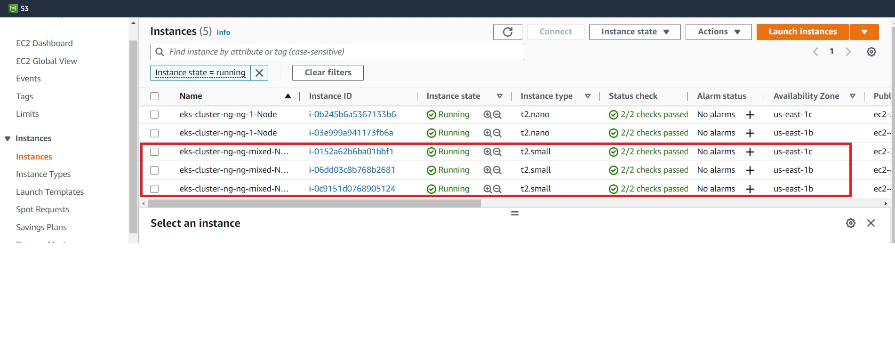

# Extend Cluster 
In this section we will extend the cluster by adding a nodegroup that contains a mix of:

* On-demand instances
* Spot instances

## Define Yaml file 
Create folder `cluster-ng-mixed`. We will now extend the cluster by adding a nodegroup to file `eks-cluster.yaml`. The file adds a new nodegroup `ng-mixed`. 

Copy the following contents :  

```
apiVersion: eksctl.io/v1alpha5
kind: ClusterConfig

metadata:
  name: eks-cluster-ng
  region: us-east-1

nodeGroups:
  - name: ng-1
    instanceType: t2.nano
    desiredCapacity: 2
    ssh: # use existing EC2 key
      publicKeyName: eks-course
  - name: ng-mixed
    minSize: 3
    maxSize: 5
    instancesDistribution:
      maxPrice: 0.2
      instanceTypes: ["t2.small", "t3.small"]
      onDemandBaseCapacity: 0
      onDemandPercentageAboveBaseCapacity: 50
    ssh: 
      publicKeyName: eks-course

```
This tells EKS to : 

* Add a new nodegroup `ng-mixed`
* Set min & max size
* Define the instance types
* 50% of the instance types are on-demand and the rest on spot 

## Add nodegroup  
First check your cluster is running :
```
eksctl get cluster
```
```
PS C:\Users\aniru\workspace\github\aws-eks\cluster-ng> eksctl get cluster
NAME            REGION          EKSCTL CREATED
eks-cluster-ng  us-east-1       True
```
Let's add the new nodegroup :
```
eksctl create nodegroup --config-file=eks-cluster.yaml --include='ng-mixed'
```
```
PS C:\Users\aniru\workspace\github\aws-eks\cluster-ng-mixed> eksctl create nodegroup --config-file=eks-cluster.yaml --include='ng-mixed'
2023-02-14 03:25:59 [ℹ]  will use version 1.23 for new nodegroup(s) based on control plane version
2023-02-14 03:26:06 [ℹ]  nodegroup "ng-1" will use "ami-0d4bdb1cf2f07d811" [AmazonLinux2/1.23]
2023-02-14 03:26:07 [ℹ]  using EC2 key pair "eks-course"
2023-02-14 03:26:07 [ℹ]  nodegroup "ng-mixed" will use "ami-0d4bdb1cf2f07d811" [AmazonLinux2/1.23]
2023-02-14 03:26:08 [ℹ]  using EC2 key pair "eks-course"
2023-02-14 03:26:11 [ℹ]  1 existing nodegroup(s) (ng-1) will be excluded
2023-02-14 03:26:11 [ℹ]  combined include rules: ng-mixed
2023-02-14 03:26:11 [ℹ]  1 nodegroup (ng-mixed) was included (based on the include/exclude rules)
2023-02-14 03:26:11 [ℹ]  will create a CloudFormation stack for each of 1 nodegroups in cluster "eks-cluster-ng"
```
Note line ***combined include rules: ng-mixed***

Also check the new nodegroup `ng-mixed` created after a few minutes by running below command. Check min size and max size  : 

```
PS C:\Users\aniru\workspace\github\aws-eks> eksctl get nodegroup --cluster=eks-cluster-ng
CLUSTER         NODEGROUP       STATUS          CREATED                 MIN SIZE        MAX SIZE        DESIRED CAPACITY        INSTANCE TYPE   IMAGE ID           ASG NAME                                                         TYPE
eks-cluster-ng  ng-1            CREATE_COMPLETE 2023-02-14T07:23:00Z    2               2               2                       t2.nano         ami-0d4bdb1cf2f07d811       eksctl-eks-cluster-ng-nodegroup-ng-1-NodeGroup-1LRT8H4ZKAVO9            unmanaged
eks-cluster-ng  ng-mixed        CREATE_COMPLETE 2023-02-14T08:26:13Z    3               5               3                       t2.small        ami-0d4bdb1cf2f07d811       eksctl-eks-cluster-ng-nodegroup-ng-mixed-NodeGroup-1I8YSGYWKO2O5        unmanaged
```

You can also review this on AWS console :



## Delete nodegroup  
Now let's drain the `ng-mixed` nodegroup we just created so we don't incur additional costs :
```
eksctl delete nodegroup --config-file=eks-cluster.yaml --include='ng-mixed' --approve
```
The draining will usually take some time as is indicated by ***STATUS=DELETE_IN_PROGRESS***:
```
PS C:\Users\aniru\workspace\github\aws-eks> eksctl get nodegroup --cluster=eks-cluster-ng
CLUSTER         NODEGROUP       STATUS                  CREATED                 MIN SIZE        MAX SIZE        DESIRED CAPACITY        INSTANCE TYPE   IMAGE ID   ASG NAME                                                         TYPE
eks-cluster-ng  ng-1            CREATE_COMPLETE         2023-02-14T07:23:00Z    2               2               2                       t2.nano         ami-0d4bdb1cf2f07d811       eksctl-eks-cluster-ng-nodegroup-ng-1-NodeGroup-1LRT8H4ZKAVO9            unmanaged
eks-cluster-ng  ng-mixed        DELETE_IN_PROGRESS      2023-02-14T08:26:13Z    0               0               0                       t2.small        ami-0d4bdb1cf2f07d811       eksctl-eks-cluster-ng-nodegroup-ng-mixed-NodeGroup-1I8YSGYWKO2O5        unmanaged
```


