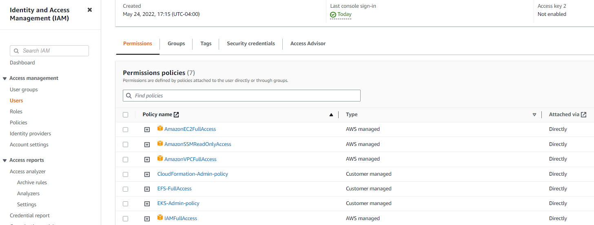

# Prerequisites

## IAM user and permissions
We will create a new IAM user (`eks-asingh`) for the purposes of the tutorial. Please keep in mind that you should *never* use your root account for working with AWS services. 

### Create Policies
Create these 2 policies:

* EKS-Admin-policy:
```
    {
        "Version": "2012-10-17",
        "Statement": [
            {
                "Effect": "Allow",
                "Action": [
                    "eks:*"
                ],
                "Resource": "*"
            }
        ]
    }
```

* CloudFormation-Admin-policy:
```
    {
        "Version": "2012-10-17",
        "Statement": [
            {
                "Effect": "Allow",
                "Action": [
                    "cloudformation:*"
                ],
                "Resource": "*"
            }
        ]
    }
```

### Assign Policies
Finally, assign the following policies to your IAM user you are going to use throughout the course:

  * AmazonEC2FullAccess
  * IAMFullAccess
  * AmazonVPCFullAccess
  * CloudFormation-Admin-policy
  * EKS-Admin-policy  

where the last 2 policies are the ones you created above



## Create IAM role
* open ```https://console.aws.amazon.com/iam/``` and choose _Roles_ => _create role_  
* choose _EKS_ service followed by _Allows Amazon EKS to manage your clusters on your behalf_  
* choose _Next: Permissions_
* click _Next: Review_
* enter a *unique* Role name, _EKS-course-role_ and click *_Create Role_*

## Create Key Pair

* open EC2 dashboard ```https://console.aws.amazon.com/ec2```
* click _KeyPairs_ in left navigation bar under section "Network&Security"
* click _Create Key Pair_
* provide name for keypair, _eks-course_ and click *_Create_*
* !! the keypair will be downloaded immediately => file *eks-course.pem* !!

## Create API Access key/-secret
* create key+secret via AWS console
  AWS-console => IAM => Users => <your user> => tab *Security credentials* => button *Create access key*